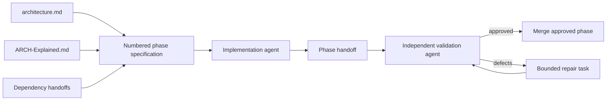

# AEGIS v1.0 — Phase Execution Protocol

> **Mandatory for implementation agents, validation agents, and repair agents.**

## 1. Why this protocol exists

AEGIS v1.0 is intentionally a complete product rather than a tiny prototype. Scope remains manageable because no agent receives the full system as one undifferentiated task. The long-lived architecture files define system truth; a numbered phase defines one bounded implementation unit; a handoff compresses completed work for dependent agents; and an independent validator confirms that code and evidence match the specification.



## 2. Context-loading order

An implementation agent should read:

1. Project-root `architecture.md`.
2. The assigned numbered phase specification.
3. Relevant sections of `ARCH-Explained.md`.
4. `PHASE-EXECUTION-PROTOCOL.md`.
5. Project-root `bestPractices.txt`.
6. Direct dependency handoffs.
7. Relevant ADRs.
8. Existing code, tests, migrations, fixtures, and package documentation in affected areas.

Do not load every future phase into the context window. Use the master roadmap to understand placement, then load only the current phase and direct dependencies unless a concrete interface question requires more.

## 3. Implementation-agent responsibilities

The implementation agent must:

- Inspect the repository before creating new modules.
- Preserve previous approved behavior.
- Implement all in-scope requirements in production paths.
- Reuse canonical contracts and package boundaries.
- Add meaningful success, failure, recovery, security, and regression tests.
- Run the phase and root validation commands.
- Produce the required handoff with factual evidence.
- Stop when an architecture-level conflict requires an ADR rather than silently changing the design.

The implementation agent may make ordinary local design decisions consistent with the architecture. It may not weaken acceptance criteria, silently change durable contracts, add a new platform technology, or absorb future-phase scope merely because it is convenient.

## 4. Validation-agent responsibilities

The validator is an independent reviewer. It must inspect code and re-run important commands. It should look specifically for:

- Acceptance criteria implemented only by mocks, hard-coded values, fixtures on production paths, or unreachable flags.
- Tests that assert file existence or snapshots without proving behavior.
- Duplicate domain models or incompatible event/API types.
- Direct database writes from route handlers.
- Missing idempotency, stale-state handling, bounded retries, or recovery.
- Frontend-only authorization.
- Agent tools that bypass policy or execute simulator changes directly.
- Replay code that queries only current state rather than historical state.
- Three.js or generated narrative that invents domain facts.
- Secret leakage, unrestricted egress, or unsafe scenario execution.
- Handoff claims that do not match the current tree.

The validator returns either:

- `APPROVED` with commands and evidence, or
- `CHANGES REQUIRED` with a reproducible defect list mapped to acceptance criteria.

## 5. Repair-task rules

A repair task is narrower than the original phase. It contains only:

- Failed criteria.
- Reproduction commands.
- Affected contracts/files.
- Required corrections.
- Required regression tests.
- Required validation commands.

Do not use repair work to add unrelated enhancements or reopen settled architecture.

## 6. Standard handoff format

Every completed phase creates:

```text
handoffs/NN-phase-slug-HANDOFF.md
```

Required sections:

```markdown
# Phase NN Handoff — Title

## Status
## Implemented
## Files added
## Files modified
## Files removed
## Contracts introduced or changed
## Database migrations
## Environment and configuration changes
## Generated artifacts and fixtures
## Tests added
## Commands executed and results
## Architecture decisions and ADRs
## Known limitations
## Deferred work
## Risks for dependent phases
## Acceptance criteria evidence
## Prohibited-shortcut confirmation
```

## 7. ADR rule

Create an Architecture Decision Record before changing:

- A non-negotiable rule in `architecture.md`.
- Durable event or ID semantics.
- Database or event-delivery technology.
- Package dependency direction.
- Authorization or agent execution boundaries.
- Simulation determinism assumptions.
- The 2D/3D source-of-truth relationship.
- Deployment shape or a major managed service.
- Compatibility policy for published scenario/model/report artifacts.

An ADR does not automatically approve a change. The project owner must approve architecture-changing ADRs.

## 8. Git and branch discipline

- Begin from the latest approved dependency state.
- Keep commits scoped and descriptive.
- Do not commit secrets, local databases, caches, provider credentials, or unapproved large artifacts.
- Do not mass-format unrelated files.
- Commit migrations, tests, docs, handoff, and ADRs with the implementation they describe.
- Never rewrite published scenario versions, released model manifests, or approved golden artifacts without an explicit versioned change.

## 9. Definition of approval

A phase is approved only when code, tests, commands, documentation, migrations/configuration, security/reliability behavior, and handoff evidence all pass. “The code is present,” “the agent completed the task,” and “the demo looks good” are not sufficient evidence.
