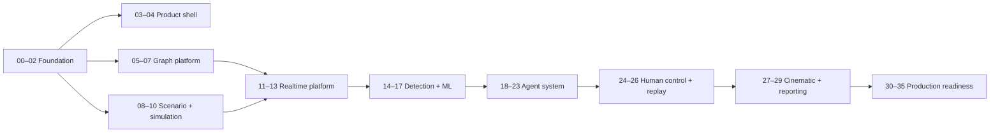

# AEGIS v1.0 — Agent Implementation Specifications

This package contains **36 numbered implementation specifications**, Phase `00` through Phase `35` inclusive. The earlier discussion called them “35 phases,” but the agreed numbering contains 36 tasks because zero is included.

The target is a complete product-ready AEGIS v1.0 built through bounded, independently validated agent work. Overall product ambition is not reduced; context and risk are controlled at the phase level.


## Mandatory best-practices SOP

Every implementation, validation, and repair agent must also read
`bestPractices.txt`. It defines the project-wide coding, security, dependency,
testing, framework, package-manager, supply-chain, and definition-of-done
standards. PNPM is the canonical JavaScript/TypeScript package manager; npm,
npx, Yarn, and Bun package-management commands are prohibited.

## Architecture-version alignment

The existing architecture documents were initially drafted with some `v0.1` status wording. This specification set treats the agreed complete vertical product as **AEGIS v1.0**. Before Phase 00 begins, update those status labels or add an approved scope note so implementation agents do not interpret the earlier label as permission to build only a prototype. The architecture rules themselves remain authoritative.

## How to place this in the repository

Recommended location:

```text
AEGIS/
├── architecture.md
├── ARCH-Explained.md
├── specs/
│   └── v1/
│       ├── README.md
│       ├── PHASE-EXECUTION-PROTOCOL.md
│       ├── foundation/
│       └── ...
├── handoffs/
└── adrs/
```

The package includes `handoffs/` and `adrs/` starter folders. Move them to project root instead when that better matches the final repository structure; update references consistently.

## Mandatory context for an implementation agent

1. Project-root `architecture.md`
2. Assigned phase specification
3. `PHASE-EXECUTION-PROTOCOL.md`
4. Relevant sections of `ARCH-Explained.md`
5. Approved direct-dependency handoffs
6. Relevant ADRs and affected existing code/tests

Do not give every future phase to one agent. That defeats the context-window and scope-control strategy.

## Folder map

```text
AEGIS-v1.0-Agent-Specs/
├── foundation/                         # 00–02
├── product-shell/                      # 03–04
├── graph-platform/                     # 05–07
├── scenario-and-simulation/            # 08–10
├── realtime-platform/                  # 11–13
├── detection-and-machine-learning/     # 14–17
├── agent-system/                       # 18–23
├── human-control-and-replay/           # 24–26
├── cinematic-and-reporting/            # 27–29
├── production-readiness/               # 30–35
├── handoffs/
├── adrs/
├── PHASE-EXECUTION-PROTOCOL.md
├── PHASE-SPEC-TEMPLATE.md
└── MANIFEST.json
```

## Simplified roadmap



The diagram is intentionally simplified. The direct-dependency column and each phase specification are authoritative for scheduling.

## Phase manifest

| Phase | Specification | Group | Direct dependencies |
|---:|---|---|---|
| 00 | [Repository and Engineering Standards](foundation/00-repository-and-engineering-standards.md) | `foundation` | — |
| 01 | [Shared Contracts](foundation/01-shared-contracts.md) | `foundation` | 00 |
| 02 | [Database Foundation](foundation/02-database-foundation.md) | `foundation` | 00, 01 |
| 03 | [Command-Centre Design System](product-shell/03-command-centre-design-system.md) | `product-shell` | 00 |
| 04 | [Application Shell](product-shell/04-application-shell.md) | `product-shell` | 01, 03 |
| 05 | [Graph Domain Engine](graph-platform/05-graph-domain-engine.md) | `graph-platform` | 01 |
| 06 | [Sigma.js Operational Graph](graph-platform/06-sigma-operational-graph.md) | `graph-platform` | 03, 04, 05 |
| 07 | [Graph Performance and Worker Layouts](graph-platform/07-graph-performance-and-worker-layouts.md) | `graph-platform` | 05, 06 |
| 08 | [Scenario SDK](scenario-and-simulation/08-scenario-sdk.md) | `scenario-and-simulation` | 00, 01 |
| 09 | [Deterministic Simulation Core](scenario-and-simulation/09-deterministic-simulation-core.md) | `scenario-and-simulation` | 01, 02, 08 |
| 10 | [Operation Silent Relay Content](scenario-and-simulation/10-operation-silent-relay.md) | `scenario-and-simulation` | 05, 08, 09 |
| 11 | [Event Persistence and Streaming](realtime-platform/11-event-persistence-and-streaming.md) | `realtime-platform` | 01, 02, 09 |
| 12 | [WebSocket Gateway](realtime-platform/12-websocket-gateway.md) | `realtime-platform` | 01, 02, 11 |
| 13 | [Live Command-Centre Integration](realtime-platform/13-live-command-centre-integration.md) | `realtime-platform` | 04, 06, 10, 11, 12 |
| 14 | [Feature Pipeline](detection-and-machine-learning/14-feature-pipeline.md) | `detection-and-machine-learning` | 01, 09, 11 |
| 15 | [Rules and Statistical Baselines](detection-and-machine-learning/15-rules-and-statistical-baselines.md) | `detection-and-machine-learning` | 02, 14 |
| 16 | [Anomaly Model](detection-and-machine-learning/16-anomaly-model.md) | `detection-and-machine-learning` | 02, 14, 15 |
| 17 | [Graph Risk Propagation](detection-and-machine-learning/17-graph-risk-propagation.md) | `detection-and-machine-learning` | 05, 14, 15, 16 |
| 18 | [Model-Provider Abstraction](agent-system/18-model-provider-abstraction.md) | `agent-system` | 00, 01, 02 |
| 19 | [Agent Runtime](agent-system/19-agent-runtime.md) | `agent-system` | 01, 02, 11, 18 |
| 20 | [WATCHTOWER and TRACE](agent-system/20-watchtower-and-trace.md) | `agent-system` | 13, 15, 17, 19 |
| 21 | [ORACLE](agent-system/21-oracle.md) | `agent-system` | 19, 20 |
| 22 | [BASTION and WARDEN](agent-system/22-bastion-and-warden.md) | `agent-system` | 15, 17, 19, 21 |
| 23 | [SCRIBE](agent-system/23-scribe.md) | `agent-system` | 19, 20, 21, 22 |
| 24 | [Approval Workflow](human-control-and-replay/24-approval-workflow.md) | `human-control-and-replay` | 02, 12, 13, 22 |
| 25 | [Snapshot and Replay Engine](human-control-and-replay/25-snapshot-and-replay-engine.md) | `human-control-and-replay` | 02, 09, 11 |
| 26 | [Replay Frontend](human-control-and-replay/26-replay-frontend.md) | `human-control-and-replay` | 04, 06, 12, 13, 25 |
| 27 | [Three.js Semantic Renderer](cinematic-and-reporting/27-threejs-semantic-renderer.md) | `cinematic-and-reporting` | 05, 06, 07, 25 |
| 28 | [Cinematic Incident Replay](cinematic-and-reporting/28-cinematic-incident-replay.md) | `cinematic-and-reporting` | 26, 27 |
| 29 | [Scoring and After-Action Experience](cinematic-and-reporting/29-scoring-and-after-action-experience.md) | `cinematic-and-reporting` | 10, 23, 25, 26 |
| 30 | [Authentication and Authorization](production-readiness/30-authentication-and-authorization.md) | `production-readiness` | 00, 02, 04, 24 |
| 31 | [Observability](production-readiness/31-observability.md) | `production-readiness` | 00, 02, 11, 12, 14, 18, 19 |
| 32 | [Security Hardening](production-readiness/32-security-hardening.md) | `production-readiness` | 19, 22, 24, 30, 31 |
| 33 | [Cloud Deployment](production-readiness/33-cloud-deployment.md) | `production-readiness` | 00, 02, 11, 12, 30, 31, 32 |
| 34 | [Full-System Validation](production-readiness/34-full-system-validation.md) | `production-readiness` | 00, 01, 02, 03, 04, 05, 06, 07, 08, 09, 10, 11, 12, 13, 14, 15, 16, 17, 18, 19, 20, 21, 22, 23, 24, 25, 26, 27, 28, 29, 30, 31, 32, 33 |
| 35 | [v1.0 Release Preparation](production-readiness/35-v1-release-preparation.md) | `production-readiness` | 29, 33, 34 |

## Recommended execution loop

1. Select the earliest unapproved phase with approved dependencies.
2. Provide the implementation agent only the required architecture/spec/handoffs and repository access.
3. Require production code, tests, exact validation output, and the phase handoff.
4. Give a separate validation agent the same specification plus the implementation and handoff.
5. Approve or create a narrow repair task.
6. Merge the approved phase before dependent phases begin.
7. Run cross-phase integration checks whenever shared contracts, migrations, or event schemas change.

Parallel work is allowed only where shared contracts are stable and agents own non-overlapping packages. Parallel agents must never create competing definitions of assets, relationships, events, incidents, evidence, commands, graph deltas, features, agent artifacts, or approvals.
