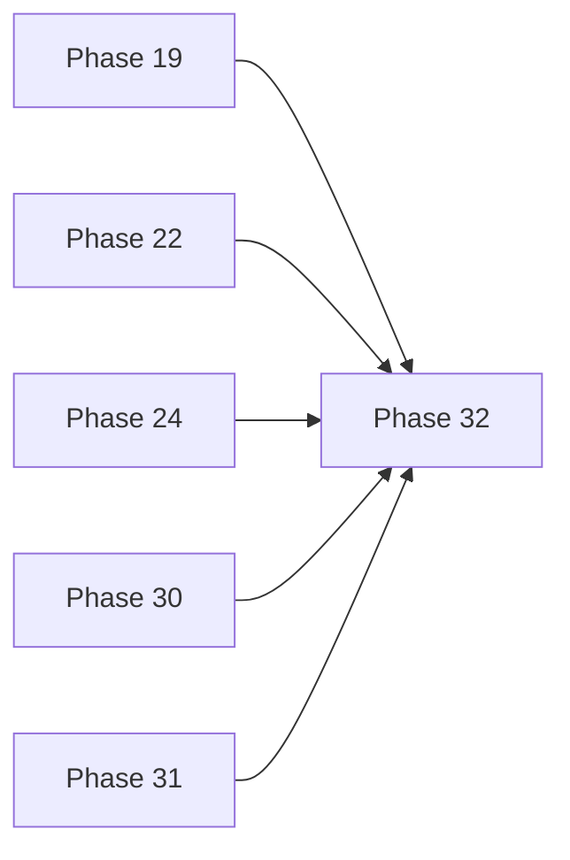
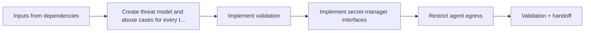

# Phase 32 — Security Hardening

> **Audience:** Autonomous coding agent implementing a single bounded AEGIS v1.0 phase  
> **Status:** Planned implementation specification  
> **Group:** `production-readiness`  
> **Primary output:** Production-path code, tests, documentation, validation evidence, and an approved handoff  
> **Do not interpret this document as permission to implement unrelated future phases.**

---

## 1. Agent directive

Implement **Phase 32 only**. Treat project-root `architecture.md` as a binding architecture contract and this file as the acceptance contract for the current task.

The repository may already contain partial work. Inspect it first. Reuse correct implementations, repair incomplete ones, and document what was reused. Do not create a second architecture beside the existing one. A phase is not complete because files exist or a demo screenshot looks correct; it is complete only when its production path, failure path, tests, documentation, commands, and handoff satisfy this specification.

## 2. Purpose

Threat-model and harden browser, APIs, realtime, scenarios, agents, providers, storage, containers, dependencies, and cloud boundaries.

## 3. Product outcome

When this phase is approved, the project must have a reliable, testable capability that later phases can consume without guessing its semantics. The result must work through canonical interfaces, not through scenario-specific shortcuts or undocumented coupling.

## 4. Roadmap position



### Direct dependencies

- Phase 19 — Agent Runtime (`agent-system/19-agent-runtime.md`) and its approved handoff
- Phase 22 — BASTION and WARDEN (`agent-system/22-bastion-and-warden.md`) and its approved handoff
- Phase 24 — Approval Workflow (`human-control-and-replay/24-approval-workflow.md`) and its approved handoff
- Phase 30 — Authentication and Authorization (`production-readiness/30-authentication-and-authorization.md`) and its approved handoff
- Phase 31 — Observability (`production-readiness/31-observability.md`) and its approved handoff

### Parallel-work rule

Parallel work is permitted only when dependencies and shared contracts are already frozen. Parallel agents must not create competing definitions of the same entity, event, command, graph payload, feature, policy, or UI state.

## 5. Required reading

- Project-root `architecture.md` — authoritative implementation contract.
- Project-root `ARCH-Explained.md` — detailed reasoning for the relevant system areas.
- `PHASE-EXECUTION-PROTOCOL.md` in this specification package — mandatory implementation and validation workflow.
- Every direct dependency specification and its approved handoff listed below.
- Relevant ADRs, existing code, tests, migrations, fixtures, and package READMEs in the affected areas.

Load only context relevant to this phase. The point of the phase system is to protect context-window quality while preserving architecture consistency.

## 6. Preconditions

- All direct dependencies are merged and approved, or the repository already contains demonstrably equivalent behavior.
- The branch starts from a clean working tree and the latest approved dependency state.
- The agent has inspected existing implementations before proposing new packages or duplicate contracts.
- No unresolved architecture conflict is hidden in a dependency handoff.

If a precondition is false, investigate whether the repository already provides an equivalent capability. If not, stop and produce a blocker report rather than silently absorbing the missing dependency.

## 7. In scope

- Create threat model and abuse cases for every trust boundary.
- Implement validation, encoding, CSRF/CORS/CSP/security headers, rate/body/upload limits, and signed private-object access.
- Implement secret-manager interfaces, startup secret validation, rotation guidance, and redaction.
- Restrict agent egress, filesystem, provider destinations, tool allowlists, and scenario influence over privileged instructions.
- Harden containers with non-root users, minimal capabilities, read-only filesystems where practical, pinned bases, and SBOM.
- Add SAST, dependency, license, secret, container, and IaC scans with triage policy.
- Run safe local prompt-injection, approval-bypass, egress, and boundary penetration tests.

## 8. Explicitly out of scope

- No offensive tooling, real target testing, certification claims, or security by obscurity.
- No unrestricted shell/network access for agents.

Out-of-scope work may be recorded as deferred in the handoff. It may not be implemented speculatively unless a minimal interface is explicitly necessary for this phase and does not commit a future design.

## 9. Architectural invariants

- PostgreSQL remains authoritative. Redis, browser state, rendered graphs, caches, snapshots, model outputs, and reports are projections or artifacts.
- Durable domain changes emit schema-versioned append-only events with monotonic per-run sequence numbers. State and outbox records commit atomically.
- The simulation is deterministic for a fixed scenario version, seed, and configuration. Nondeterministic model output is persisted as an artifact rather than regenerated during replay.
- State-changing agent behavior is a proposal. Important actions pass deterministic policy, explicit human approval, final revalidation, and an internal idempotent simulator command.
- The Sigma.js/Graphology 2D graph is the primary analysis tool. Three.js is a later read-only presentation adapter over the same semantic state.
- Provider SDKs, storage vendors, and cloud-specific clients remain behind adapters. Domain packages depend on protocols and canonical contracts.
- AEGIS remains a synthetic defensive simulation. Do not add real intrusion, exploit execution, offensive tooling, unrestricted agent shell/network access, or autonomous production remediation.

### Group-specific rules

- Security and authorization are server-enforced and tested, never inferred from UI visibility.
- Operational claims require logs, metrics, traces, test evidence, and reproducible deployment artifacts.
- Do not expand into multi-region, internet-scale, or Kubernetes complexity without measured need and an ADR.

## 10. Required technical behavior

1. Inspect before editing. Reuse approved modules and contracts; do not create a parallel implementation merely because it is easier in isolation.
2. Keep route handlers, React route components, queue entry points, and CLI commands thin. Put business behavior in testable domain/application modules.
3. Validate every boundary input at runtime and return structured errors with stable codes and trace identifiers where applicable.
4. Make idempotency, ordering, concurrency, retry, timeout, and cancellation semantics explicit for every operation that can repeat or run asynchronously.
5. Emit structured logs and instrumentation hooks with relevant run, incident, agent-session, event-sequence, actor, and trace context.
6. Document environment variables, migrations, generated artifacts, schema versions, and any operational command introduced by the phase.
7. Preserve compatibility with prior phase fixtures and tests. Intentional breaking changes require an approved ADR or explicit task revision.
8. Security and authorization are server-enforced and tested, never inferred from UI visibility.
9. Operational claims require logs, metrics, traces, test evidence, and reproducible deployment artifacts.
10. Do not expand into multi-region, internet-scale, or Kubernetes complexity without measured need and an ADR.

## 11. Phase execution flow



The flow is conceptual. The agent must adapt exact file order to the existing repository while preserving the dependency and validation boundaries shown above.

## 12. Owned or extended contracts

This phase owns or materially extends the following contracts/interfaces:

- threat model
- security control matrix
- egress policy
- tool security policy
- upload/package policy
- exception record

Contract rules:

- Import Phase 01 canonical primitives rather than redeclaring IDs, timestamps, errors, sequence, revision, trace, causation, or correlation fields.
- Durable or cross-process contracts require an explicit schema/protocol version.
- Cross-language contracts require Python/TypeScript compatibility fixtures.
- Additive optional changes may remain compatible; semantic or required-field changes require a version bump and migration notes.
- Every contract must define validation, serialization, failure behavior, and ownership.
- Renderer, ORM, framework, and provider implementation types must not leak into domain contracts.

## 13. Expected package and file areas

The agent should expect to add or modify these areas:

- docs/security/threat-model.md
- docs/security/control-matrix.md
- infra/security/**
- services/agents/security/**
- tests/security/**
- .github/workflows/security*.yml

Exact filenames may be adjusted only to match an already-approved repository structure. Any unavoidable cross-phase edit must be called out in the handoff with its reason and risk.

## 14. Required implementation sequence

1. Read the required documents and inspect the current repository, dependency handoffs, existing tests, and open ADRs.
2. Create a short implementation plan mapping each in-scope deliverable and acceptance criterion to packages, contracts, tests, and validation evidence.
3. Define or extend the smallest canonical contracts required by this phase. Update compatibility fixtures before wiring consumers.
4. Implement deterministic domain/application logic and error types first, then persistence, workers, routes, adapters, or UI integration.
5. Add security/authorization hooks, idempotency, failure recovery, structured logging, and telemetry at the boundary where they belong.
6. Implement the test matrix in Section 16, including failure paths and regression coverage.
7. Run all phase and root validation commands. Fix failures without weakening tests, lint rules, typing, or prior guarantees.
8. Create `handoffs/32-security-hardening-HANDOFF.md` after validation and provide precise evidence for every acceptance criterion.

## 15. Error, security, reliability, and observability requirements

- Distinguish validation, authorization, conflict/stale state, dependency unavailable, retryable, timeout, cancellation, and internal errors.
- Fail closed for unsafe, unauthorized, schema-incompatible, checksum-invalid, or stale operations.
- Do not log secrets, tokens, private keys, provider credentials, unrestricted prompts, or unredacted sensitive headers.
- Bounded retries must use idempotency and distinguish transient failures from permanent validation/policy failures.
- One worker, provider, model, renderer, or agent failure must not corrupt authoritative state or silently lose required events.
- Background operations require explicit ownership, cancellation/shutdown, dead-letter or terminal-failure behavior, and telemetry.
- User-facing errors must be actionable without exposing sensitive internals.
- New metrics must avoid uncontrolled high-cardinality labels; use traces/logs for entity-level identifiers.

## 16. Required tests

- Unit tests for deterministic domain logic, validation, and edge cases introduced by this phase.
- Contract or schema tests for every durable, cross-language, cross-process, or externally consumed interface.
- Failure-path tests proving invalid, stale, duplicate, unauthorized, unavailable, or corrupted inputs fail safely.
- Regression tests for every defect discovered during implementation.
- Integration tests use the real relevant PostgreSQL, Redis, object-storage, worker, or provider-fake boundaries; do not substitute behaviorally different in-memory systems.
- Security tests attempt bypasses rather than checking only the intended UI path.
- Acceptance-criterion tests map explicitly to the criteria in Section 18 so the validation agent can verify them mechanically.

## 17. Validation commands

Run the phase-specific commands below plus any narrower package commands introduced by the implementation:

```bash
pnpm format:check
pnpm lint
pnpm typecheck
pnpm test
pnpm build
uv run ruff check .
uv run mypy apps services packages
uv run pytest -q
docker compose up -d postgres redis object-storage
uv run pytest tests/integration -q
```

Record each exact command and result in the handoff. When a listed command does not yet exist, this phase must add the canonical equivalent or document the existing approved command that replaces it.

## 18. Acceptance criteria

- Threats map to implemented controls and tests.
- Scenario/model content cannot bypass policy or tool authorization.
- Agents cannot reach arbitrary network/filesystem/execution.
- Critical findings are fixed or have explicit approved time-bounded exceptions.

All criteria are mandatory unless the project owner approves a revised task or ADR. “Mostly complete” is not an approval state.

## 19. Forbidden shortcuts

- Do not stop at scaffolding, generated types, static mock screens, empty service methods, TODO comments, or unreachable feature flags.
- Do not hard-code Silent Relay values into platform code unless this phase is explicitly scenario content.
- Do not duplicate an existing domain type, event, graph schema, API model, or policy rule in a second package.
- Do not use client-side hiding, prompt wording, or model self-restraint as an authorization or safety control.
- Do not delete, skip, loosen, or rewrite existing tests merely to make the phase pass.
- Do not claim commands ran when they were not executed in the current tree.
- Do not mass-format or opportunistically refactor unrelated packages.
- Do not implement later-phase features except for a minimal interface explicitly required by this specification.

## 20. Required handoff

Create `handoffs/32-security-hardening-HANDOFF.md` with these sections:

1. Status: `READY FOR VALIDATION`, `BLOCKED`, or `FAILED`.
2. Implemented behavior mapped to Sections 7 and 18.
3. Files added, modified, and removed, with reasons.
4. Contracts/interfaces introduced or changed, including versions.
5. Migrations, environment variables, fixtures, generated artifacts, and operational commands.
6. Tests added and what each proves.
7. Exact validation commands and results.
8. Architecture decisions and ADR references.
9. Known limitations and deliberately deferred work.
10. Risks and instructions for dependent phases.
11. Evidence for every acceptance criterion.
12. Confirmation that no prohibited shortcut was used.

The handoff is compressed context for later agents and must describe the actual implementation, not repeat this specification.

## 21. Independent validation checklist

The validation agent must:

- Trace every acceptance criterion to working code and test evidence.
- Inspect production paths for mocks, hard-coded demo values, empty handlers, TODO-only logic, or unreachable feature flags.
- Verify dependency direction and canonical contract reuse.
- Re-run the important commands rather than trusting the handoff.
- Exercise at least one invalid/failure/recovery path.
- Confirm authorization, safety, idempotency, ordering, and replay implications where relevant.
- Confirm documentation matches the implementation.
- Return `APPROVED` only when every mandatory criterion passes; otherwise provide a narrow reproducible defect list.

## 22. Stop and escalate conditions

- The requested implementation conflicts with a non-negotiable architecture rule.
- A dependency contract is missing or contradictory and resolving it requires a breaking change.
- The only proposed path introduces real offensive capability, unrestricted agent execution/egress, or production remediation.
- A destructive migration, new durable technology, security-sensitive provider decision, or deployment-shape change requires owner approval.
- The acceptance criteria cannot be tested reliably without revising the phase specification.

A stop condition is not permission to avoid ordinary debugging, repository inspection, test writing, or a bounded design choice already authorized here.

## 23. Completion checklist

- [ ] Required architecture, spec, ADRs, and dependency handoffs were read.
- [ ] Existing code was inspected before new modules were created.
- [ ] Every in-scope deliverable has production-path implementation.
- [ ] Out-of-scope work was not absorbed.
- [ ] Canonical contracts were reused and correctly versioned.
- [ ] Failure, security, authorization, idempotency, and recovery behavior were implemented where applicable.
- [ ] Required tests pass without weakening prior coverage.
- [ ] Root formatting, lint, typing, tests, and affected builds pass.
- [ ] Documentation/configuration/migrations are complete.
- [ ] The required handoff contains exact validation evidence.
- [ ] Every acceptance criterion in Section 18 is satisfied.
