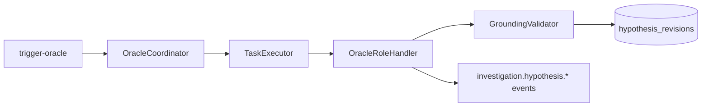

# Phase 21 — ORACLE

> Evidence-grounded competing hypotheses on the Phase 19 agent runtime.

## Scope

Phase 21 delivers:

- Canonical hypothesis contracts in `aegis_contracts.hypothesis`
- PostgreSQL tables: `hypothesis_revisions`, `hypothesis_comparisons`, `verification_requests` (migration `008_oracle_hypotheses`)
- ORACLE role plugin under `services/agents/src/aegis_agents/roles/oracle/`
- Hypothesis tools under `services/agents/src/aegis_agents/tools/hypothesis/`
- API route `POST /api/v1/runs/{run_id}/investigation/trigger-oracle`
- Command centre hypothesis UI in `apps/web/features/investigation/`

Phase 21 does **not** implement BASTION/WARDEN response proposals, SCRIBE reporting, approval workflows, containment execution, or simulator mutation.

## Architecture

- **HypothesisV1** — stable identity anchor (`id`, `incidentId`, `currentRevisionId`, `family`, `status`)
- **HypothesisRevisionV1** — append-only rich content (claims, confidence, contradictions, unknowns, predictions)
- **Grounding** — every factual claim must resolve to visible evidence or be downgraded/marked unsupported
- **Comparison** — `HypothesisComparisonV1` matrix across competing active hypotheses
- **Verification** — bounded `VerificationRequestV1` may enqueue focused TRACE follow-up

## Triggers

ORACLE requires prior WATCHTOWER triage and TRACE evidence artifacts on the investigation. The coordinator is idempotent on `(incident_id, idempotency_key)`.

## Tool boundaries

| Tool | Class | ORACLE |
|------|-------|--------|
| `list_hypotheses` | read | yes |
| `create_hypothesis_revision` | analysis_write | yes |
| `request_trace_verification` | analysis_write | yes |
| `retire_hypothesis` | analysis_write | yes |
| `create_action_proposal` | proposal | **no** |
| `attach_evidence` | analysis_write | **no** (TRACE owns collection) |
| execution-class tools | execution | **no** |

Legacy `create_hypothesis` remains for non-ORACLE roles using schema v1.

## Model integration

ORACLE uses prompt version `phase21-oracle-v1` with structured output schema `ORACLE_HYPOTHESIS_OUTPUT_SCHEMA` (requires ≥2 hypotheses). All calls go through `AgentGenerationFacade` → `GenerationService`.

## Domain events

- `investigation.hypothesis.created`
- `investigation.hypothesis.revised`
- `investigation.hypothesis.comparison.created`
- `investigation.verification.requested`

Realtime invalidation uses the existing `investigation.*` prefix in the live-run provider.

## Failure modes

- Invalid structured output is rejected; no partial hypothesis persistence
- Unsupported claims are marked `unsupported_claim` or downgraded to assumptions
- Contradictory evidence is preserved in revisions and comparison artifacts, never hidden

## References

- `docs/AEGIS-v1.0-Agent-Specs/agent-system/21-oracle.md`
- ADR 0022 — ORACLE Hypothesis Generation
- ADR 0021 — WATCHTOWER and TRACE Investigation Agents
