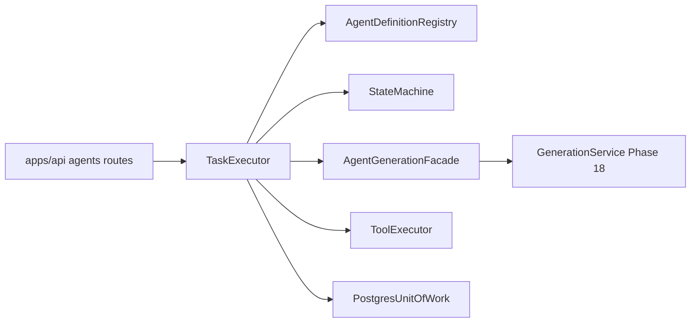

# Phase 19 — Agent Runtime

> Generic incident-scoped agent runtime foundation for Phases 20–23.

## Scope

Phase 19 delivers:

- Canonical agent runtime contracts in `aegis_contracts.agent_runtime`
- PostgreSQL tables: `agent_tasks`, `agent_state_transitions`, `tool_invocations`, `agent_artifacts`
- Runtime services under `services/agents/src/aegis_agents/runtime/`
- Tool layer under `services/agents/src/aegis_agents/tools/`
- API routes under `/api/v1/incidents/.../agent-sessions` and observability harness `/agents/observability`
- Optional worker mode `--mode agent-runtime`

Phase 19 does **not** implement WATCHTOWER/TRACE/ORACLE/BASTION/WARDEN/SCRIBE role-specific reasoning, approval workflows, simulator execution, or shell/network tools.

## Architecture



- **Session** — incident-scoped state machine (`AgentSessionState`)
- **Task** — idempotent execution unit with bounded retry (`AgentTaskStatus`)
- **Tools** — server-side allowlist; `execution` class hidden from model
- **Grounding** — evidence citations validated against session-visible evidence
- **Budget** — token/latency/cost limits per session
- **Failure isolation** — agent failures do not mutate simulation `Run` lifecycle

## Model integration

All LLM calls go through `AgentGenerationFacade` → `GenerationService` (Phase 18). Structured step output schema:

```json
{
  "rationale": "string",
  "confidence": 0.0,
  "evidenceCitations": [{ "evidenceId": "...", "rationale": "..." }],
  "toolRequests": [{ "name": "...", "arguments": {} }]
}
```

Model output is untrusted and validated before persistence or tool dispatch.

## Tool classes

| Tool | Class | Model-visible |
|------|-------|---------------|
| `list_evidence` | read | yes |
| `get_incident` | read | yes |
| `create_hypothesis` | analysis_write | yes |
| `create_action_proposal` | proposal | yes |
| `execute_simulation_command` | execution | **no** |

## API

| Route | Purpose |
|-------|---------|
| `POST /api/v1/incidents/{id}/agent-sessions` | Create session (+ optional initial task) |
| `GET /api/v1/agent-sessions/{id}` | Session detail |
| `POST /api/v1/agent-sessions/{id}/tasks` | Enqueue task |
| `POST /api/v1/agent-sessions/{id}/cancel` | Cancel in-flight work |
| `POST /api/v1/agent-tasks/{id}/retry` | Retry failed task |
| `GET /api/v1/agents/registry` | List definitions and tools |

## Commands

```bash
uv run pytest tests/agents/runtime -q
uv run pytest tests/integration/agents -q
uv run python scripts/run_agent_runtime_harness.py
node apps/web/scripts/capture-agent-runtime-demo.mjs
```

## Phase 20+ constraints

- Extend role-specific definitions in registry; do not bypass tool authorization
- Continue using Phase 18 provider facade only
- Execution-class tools remain server-only
