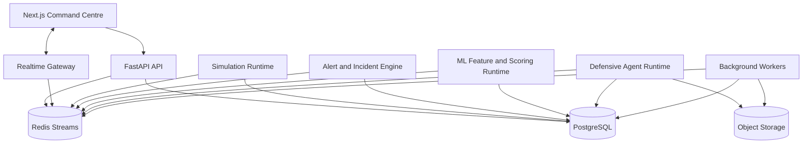
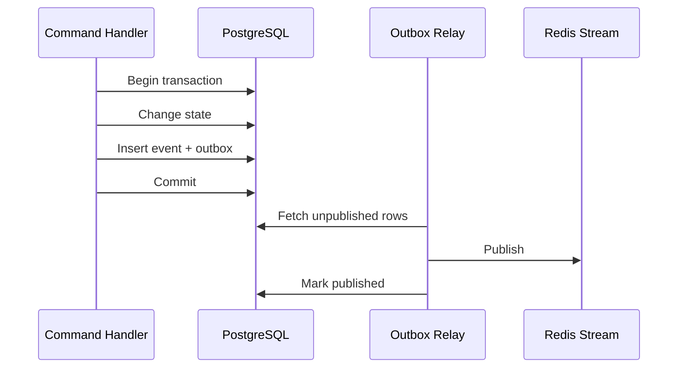
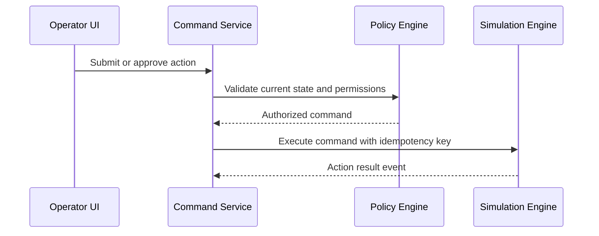
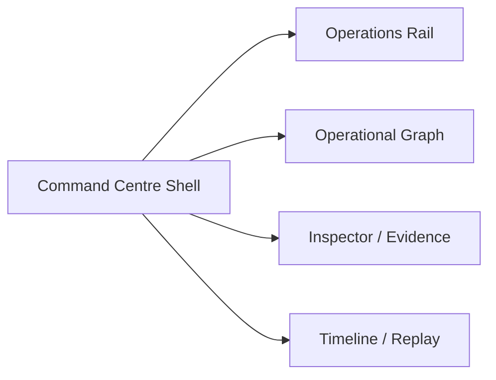
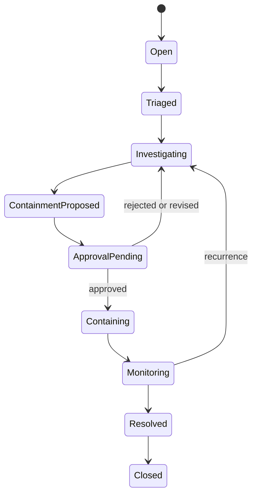
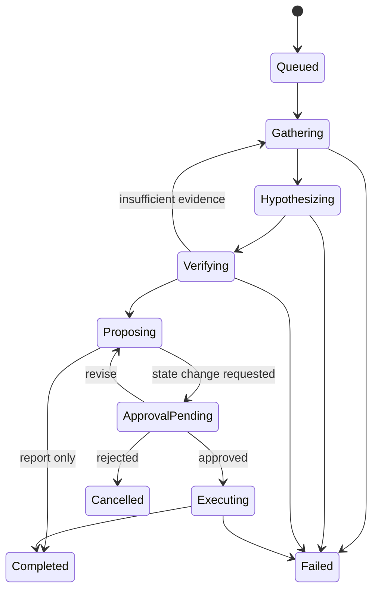

# AEGIS Command — Architecture Contract

> **Audience:** Coding agents and contributors implementing AEGIS  
> **Status:** v0.1 architecture baseline  
> **Read first:** This file is the implementation contract. `ARCH-Explained.md` contains the full reasoning and deeper design discussion.

---

## 1. Mission

AEGIS Command is an interactive cyber-defence simulation and defensive-agent evaluation platform. It models a fictional organization, emits synthetic telemetry, detects suspicious activity, correlates incidents, lets AI agents investigate through controlled tools, requires human approval for meaningful state changes, and visualizes the environment as a replayable operational graph.

The graph is not decorative. It is a projection of domain entities and relationships.

The first complete scenario is **Operation Silent Relay**.

---

## 2. Non-negotiable architecture rules

1. **PostgreSQL is the source of truth.** Redis and browser state are projections or delivery mechanisms.
2. **Simulation is deterministic.** The same scenario version, seed, and config must produce the same normalized event sequence.
3. **Domain events are append-only.** Current-state tables are maintained for fast reads; this is not pure event sourcing.
4. **State-changing agent actions are proposals.** Agents never directly mutate the simulation.
5. **Important actions require policy validation and human approval.** This is enforced in code, not only in prompts.
6. **The 2D operational graph is authoritative for analysis.** Three.js is a later derived presentation mode.
7. **Cross-language contracts are shared and versioned.** Do not independently redefine event or API shapes.
8. **Route handlers stay thin.** Business logic belongs in application/domain services.
9. **External providers stay behind adapters.** Domain code must not import vendor-specific SDKs.
10. **No offensive cyber functionality.** All activity is synthetic and confined to the scenario runtime.

Any change to these rules requires an Architecture Decision Record.

---

## 3. Technology baseline

### Frontend

- Next.js
- React
- TypeScript
- Tailwind CSS
- Radix-style accessible UI primitives
- TanStack Query for server state
- Zustand for ephemeral UI state
- Sigma.js for the primary WebGL graph
- Graphology for the graph model and algorithms
- ForceAtlas2 in a Web Worker for layout
- Three.js through React Three Fiber only for the later cinematic view
- Playwright for end-to-end tests

### Backend

- Python
- FastAPI
- Pydantic contracts
- SQLAlchemy 2-style data access
- Alembic migrations
- PostgreSQL
- Redis Streams and cache
- Dramatiq-compatible background worker pattern
- S3-compatible object storage
- OpenTelemetry-compatible logs, traces, and metrics

### ML and agents

- scikit-learn baseline models
- Optional PyTorch models after baselines
- Versioned feature definitions
- Provider-neutral LLM adapter
- Schema-constrained agent outputs
- Tool registry with server-side permission checks

---

## 4. Logical architecture



v0.1 is a modular monolith deployed as multiple processes. Do not split modules into network microservices without a measured need.

---

## 5. Repository structure

```text
AEGIS/
├── apps/
│   ├── web/
│   └── api/
├── services/
│   ├── simulation/
│   ├── incidents/
│   ├── agents/
│   ├── ml/
│   └── workers/
├── packages/
│   ├── contracts-python/
│   ├── contracts-ts/
│   ├── scenario-sdk/
│   ├── graph-domain/
│   ├── policy/
│   ├── observability/
│   └── ui/
├── scenarios/
│   └── operation-silent-relay/
├── models/
│   ├── manifests/
│   └── evaluation/
├── tests/
│   ├── contract/
│   ├── integration/
│   ├── e2e/
│   ├── performance/
│   └── golden-replays/
├── infra/
├── scripts/
├── docs/
├── architecture.md
└── ARCH-Explained.md
```

### Dependency direction

- `apps/web` depends on TypeScript contracts and UI packages.
- `apps/api` depends on Python contracts and application services.
- `services/*` may depend on domain packages and infrastructure adapters.
- Domain packages must not import web or API entry points.
- Scenario files use the scenario SDK and cannot import application internals.

---

## 6. Core domain entities

Use stable names and IDs.

| Entity | Purpose |
|---|---|
| Scenario | Immutable published scenario identity |
| ScenarioVersion | Versioned topology, generators, hidden conditions, objectives |
| Run | One scenario execution with seed and virtual clock |
| AssetInstance | User, device, service, identity, database, AI model, control, etc. |
| RelationshipInstance | Typed edge between assets |
| DomainEvent | Append-only fact with run sequence and schema version |
| Alert | Machine-generated suspicious signal |
| Incident | Correlated investigation object |
| Evidence | Stable reference to an observable fact |
| Hypothesis | Explanation with confidence and evidence |
| AgentSession | Audited agent state machine instance |
| ActionProposal | Requested world change, not yet executed |
| Approval | Human or policy decision on a proposal |
| ExecutedAction | Authoritative simulator command result |
| GraphSnapshot | Replay acceleration artifact |
| ModelVersion | Versioned model manifest and artifact pointer |
| ModelScore | Model output tied to entity, features, and version |

ID namespaces must be explicit, for example:

```text
asset:svc-logistics-api
incident:inc_01J...
alert:alt_01J...
evidence:evt_01J...
agent-session:ags_01J...
```

Never use display labels as identity.

---

## 7. Event model

Every durable event uses this envelope shape:

```json
{
  "eventId": "evt_01J...",
  "runId": "run_01J...",
  "sequence": 1842,
  "type": "telemetry.authentication.failed",
  "schemaVersion": 1,
  "simTime": "2026-01-01T18:42:03.420Z",
  "recordedAt": "2026-06-30T02:00:01.102Z",
  "actor": {"type": "asset", "id": "asset:laptop-17"},
  "subject": {"type": "asset", "id": "asset:idp-main"},
  "payload": {},
  "traceId": "trc_01J...",
  "causationId": null,
  "correlationId": null
}
```

Requirements:

- `(run_id, sequence)` is unique.
- Sequence is monotonic within a run.
- Event payloads are schema-versioned.
- Wall time and simulation time are distinct.
- Consumers must be idempotent by event ID.
- Persist domain changes and outbox rows in the same database transaction.



---

## 8. Scenario and simulation contract

The simulation runtime owns world truth.

### Required properties

- Versioned scenario definition
- Run-local seeded random generator
- Serializable virtual clock
- Priority event queue ordered by `(sim_time, priority, tie_breaker)`
- Deterministic handlers
- Checkpoint support
- Commands applied only after authorization
- Normalized-event hash test for reproducibility

### Scenario format

Use a declarative YAML or JSON manifest with:

- Metadata and version
- Assets
- Relationships
- Telemetry generators
- Hidden conditions
- Objectives
- Scoring rules
- Required platform version

Do not execute arbitrary scenario Python by default. Complex behavior must use allowlisted built-in plugins.

### Simulation command flow



---

## 9. Operational graph contract

The graph is a backend-derived semantic projection rendered by Sigma.js.

### Node minimum fields

```json
{
  "id": "asset:svc-logistics-api",
  "entityType": "asset",
  "assetType": "service",
  "label": "Logistics API",
  "clusterId": "business-unit:logistics",
  "riskScore": 0.78,
  "criticality": 0.91,
  "status": "under_investigation",
  "revision": 42
}
```

### Edge minimum fields

```json
{
  "id": "edge:...",
  "source": "asset:laptop-17",
  "target": "asset:svc-logistics-api",
  "relationshipType": "COMMUNICATED_WITH",
  "directed": true,
  "confidence": 1.0,
  "riskContribution": 0.43,
  "firstSeenAt": "...",
  "lastSeenAt": "...",
  "eventCount": 31,
  "revision": 9
}
```

### Graph layers

1. Infrastructure
2. Activity
3. Security state
4. Investigation evidence and hypotheses
5. Local presentation state

Only layer 5 is browser-local.

### Rendering rules

- Sigma.js is the primary renderer.
- Graphology stores the browser graph.
- ForceAtlas2 executes in a Web Worker.
- New nodes start near their strongest neighbor.
- Preserve node positions during a run.
- Use level of detail to prevent label and edge overload.
- Do not rerender one React component per graph node.
- Batch graph updates.
- Reduced-motion mode is mandatory.

### 3D mode

Three.js/React Three Fiber consumes the same semantic graph through a separate adapter. It cannot invent or modify domain state. Build it only after the 2D graph, incidents, and replay are functional.

---

## 10. Frontend state model

### Server state

Use TanStack Query for:

- Runs
- Scenarios
- Incidents
- Assets
- Agent records
- Reports
- Permissions

### Realtime replicated state

Use a sequence-aware reducer for WebSocket deltas. Detect gaps. On a gap, fetch missing events or a fresh snapshot before continuing.

### Ephemeral state

Use Zustand for:

- Selected entities
- Graph filters
- Camera state
- Open panels
- Timeline cursor
- Presentation mode
- Hover and focus state

Do not store authoritative risk or incident status only in Zustand.

### Main layout



---

## 11. Realtime and replay

Redis Streams provides short-term durable delivery. PostgreSQL stores long-term event history.

WebSocket messages include:

- Channel
- Run ID
- Sequence
- Message type
- Payload

The frontend reconnects with `last_applied_sequence`.

Graph and incident snapshots are stored periodically. Reconstruct a historical time by loading the closest prior snapshot and applying later events up to the target sequence or simulation time.

Required modes:

- Live
- Paused
- Historical
- Playback
- Incident-focused replay

The timeline is not a video; it reconstructs state from data.

---

## 12. ML architecture contract

### Baseline order

1. Deterministic rules
2. Isolation Forest
3. Gradient-boosted classifier with labeled scenario data
4. Autoencoder only after tabular baselines
5. Graph neural network only after graph labels and evaluation are mature

### Feature requirements

- Version every feature schema.
- Record the feature schema version with each model and score.
- Use scenario-level holdouts, not only random event-row splits.
- Preserve offline/online feature parity through shared feature code.

### Model manifest fields

- Model ID and semantic version
- Artifact checksum and object key
- Algorithm
- Feature schema version
- Training datasets/runs
- Hyperparameters
- Evaluation metrics
- Thresholds and calibration
- Code revision
- Known limitations

### Score contract

Every score must include:

- Model version
- Entity ID
- Numeric score
- Threshold/risk band
- Feature schema version
- Explanation data appropriate to the model
- Scoring time and source event/window

Do not display generated prose as the only explanation.

---

## 13. Alert and incident engine

Alert creation can be triggered by rules or model thresholds.

Incident correlation initially uses transparent rules based on:

- Shared assets or identities
- Temporal proximity
- Shared trace or request IDs
- Graph distance
- Incident family

Record why alerts were correlated.

Incident states:



All transitions emit events.

---

## 14. Agent runtime contract

Agent product roles:

- WATCHTOWER
- TRACE
- ORACLE
- BASTION
- WARDEN
- SCRIBE

Roles share one controlled runtime.

### Required runtime behavior

- Incident-scoped state machine
- Schema-constrained model output
- Allowlisted tool registry
- Persisted tool calls and results
- Evidence IDs required for factual claims
- Validation that cited evidence exists and is visible
- Token, latency, and cost budgets
- Bounded retries
- Provider adapter abstraction
- No arbitrary network access
- No direct state mutation by LLM output

### Agent states



### Tool classes

| Class | Description | Example |
|---|---|---|
| Read | No state change | `search_events`, `get_asset` |
| Analysis write | Adds investigation artifacts | `create_hypothesis` |
| Proposal | Requests a world change | `propose_isolation` |
| Execution | Internal command only after approval | simulator command adapter |

Agents can access the first three classes according to role. Execution tools are not exposed to the model.

---

## 15. Policy and approval contract

Action classes:

- Class 0: read-only
- Class 1: low-impact and reversible
- Class 2: operational state change
- Class 3: critical state change

Policy considers:

- User role
- Agent role
- Asset criticality
- Action reversibility
- Scenario restrictions
- Current incident state
- Required approvals

Class 2 and 3 actions require explicit human approval in v0.1. Revalidate policy immediately before execution.

Every proposal, policy result, approval, rejection, and execution result is audited.

---

## 16. API conventions

Use `/api/v1` for external HTTP APIs.

Representative routes:

```text
POST   /api/v1/runs
GET    /api/v1/runs/{run_id}
POST   /api/v1/runs/{run_id}/pause
POST   /api/v1/runs/{run_id}/resume
GET    /api/v1/runs/{run_id}/events
GET    /api/v1/runs/{run_id}/graph
GET    /api/v1/runs/{run_id}/graph/paths
GET    /api/v1/incidents/{incident_id}
GET    /api/v1/incidents/{incident_id}/timeline
POST   /api/v1/incidents/{incident_id}/agent-sessions
POST   /api/v1/action-proposals/{proposal_id}/approve
POST   /api/v1/action-proposals/{proposal_id}/reject
GET    /api/v1/runs/{run_id}/after-action-report
```

Rules:

- Cursor pagination for events
- Idempotency keys for retryable commands
- Standard error envelope with code, message, details, and trace ID
- Thin route handlers
- Pydantic validation at boundaries
- Never return raw ORM objects

---

## 17. Persistence rules

### PostgreSQL

Authoritative state, event history, incidents, approvals, agent audit, model metadata.

Minimum important indexes:

- Unique `(run_id, sequence)`
- `(run_id, sim_time)`
- `(run_id, event_type)`
- `(incident_id, created_at)`
- `(run_id, asset_type, status)`

Use JSONB for versioned payloads and flexible metadata, not for fields that require common filtering or constraints.

### Redis

- Streams for live event delivery
- Cache for derived short-lived values
- Worker coordination

Redis is never the only copy of authoritative data.

### Object storage

- Model artifacts
- Large transcripts
- Evaluation exports
- Snapshot archives
- Reports
- Scenario media

Store checksum, content type, size, and object key in PostgreSQL.

---

## 18. Security rules

- Production authentication uses OIDC.
- Roles: viewer, analyst, operator, scenario_author, admin.
- Secrets come from a secret manager.
- Browser bundles never contain private keys or provider secrets.
- Agent workers have restricted egress.
- Scenario telemetry is untrusted data and cannot redefine system instructions.
- Every tool call is validated server-side.
- Signed URLs are used for private object downloads.
- Audit login, scenario publication, run lifecycle, agent tools, proposals, approvals, actions, and exports.
- Dependency locking, container scanning, and secret scanning are required in CI.

---

## 19. Observability requirements

Use structured logs with relevant IDs:

- `trace_id`
- `run_id`
- `incident_id`
- `agent_session_id`
- `event_sequence`
- `service`
- `operation`

Track at minimum:

- API latency/error rate
- WebSocket connections and delivery lag
- Outbox delay
- Worker queue depth
- Simulation events/sec
- ML inference latency
- Agent cost, latency, and tool failures
- Snapshot generation time
- Approval wait time

Use distributed traces across API, database, workers, ML, agents, and realtime publication.

---

## 20. Testing requirements

Every module must include appropriate tests.

### Required suites

- Unit tests for domain logic
- Contract tests across Python and TypeScript
- Integration tests with real PostgreSQL and Redis containers
- Golden deterministic replay tests
- Agent grounding and policy tests
- Playwright end-to-end tests
- Graph performance tests

### Golden replay rule

A scenario version plus seed produces a normalized event hash. Any intentional change requires updating the golden artifact with an explanation.

### LLM independence

Core CI must pass without an external LLM. Use deterministic provider fakes for agent workflow tests.

---

## 21. Failure handling

- Simulation workers recover from checkpoints.
- Event consumers are idempotent.
- Redis loss is recoverable from PostgreSQL.
- Browser reconnect requests missing events or a new snapshot.
- Provider calls use bounded retries and circuit breaking.
- Poison jobs move to a dead-letter queue.
- One agent failure does not terminate the scenario run.
- Command execution uses idempotency keys.

---

## 22. Deployment baseline

### Local

Docker Compose:

- Web
- API
- Worker
- Simulator
- PostgreSQL
- Redis
- S3-compatible local storage

### Cloud

Containerized services on a managed container platform with:

- Managed PostgreSQL
- Managed Redis
- Object storage
- Secret manager
- Central logs, metrics, traces

Kubernetes is deferred until there is a real need for per-run jobs, autoscaling, or stronger workload isolation.

---

## 23. Implementation order

Do not start with Three.js or multi-agent autonomy.

### Phase 0

- Monorepo skeleton
- Contracts
- Event envelope
- Scenario schema
- Docker Compose
- CI

### Phase 1

- Static Operation Silent Relay topology
- Graph API
- Sigma.js graph
- Search, filter, selection, neighborhood, path highlighting
- Command-centre shell

### Phase 2

- Deterministic virtual clock and event queue
- Event persistence and outbox
- Redis Streams and WebSocket deltas
- Live graph updates
- Timeline

### Phase 3

- Feature extraction
- Rules and Isolation Forest
- Alerts and incidents
- Risk display

### Phase 4

- TRACE and ORACLE agents
- Tool registry
- Evidence-grounded hypotheses
- Provider abstraction

### Phase 5

- BASTION proposals
- WARDEN policy
- Human approval UI
- Simulator command execution

### Phase 6

- Snapshots and historical replay
- SCRIBE report
- Scoring and after-action review

### Phase 7

- Three.js cinematic view
- Enhanced presentation effects

---

## 24. Definition of done for a feature

A feature is not complete until:

- Contracts are versioned and documented.
- Domain behavior has unit tests.
- Integration boundaries have tests.
- Errors are structured and observable.
- Authorization is enforced server-side.
- Realtime changes recover after reconnect.
- Graph changes preserve stable IDs.
- Accessibility and reduced motion are considered.
- No provider-specific code leaks into domain modules.
- Relevant architecture docs are updated.

---

## 25. Prohibited shortcuts

Do not:

- Store authoritative graph state only in the browser.
- Write to domain tables directly from route handlers.
- Let an LLM return arbitrary executable code or simulator commands.
- Use labels as IDs.
- use Redis Pub/Sub as the sole event mechanism.
- add Neo4j, Kafka, Kubernetes, or a feature store without an ADR and measured need.
- build the 3D view before the operational graph and replay work.
- silently change event schemas.
- use random global state inside the simulation.
- create a second incompatible copy of shared contracts.

---

## 26. Architecture success criteria

The architecture is functioning correctly when:

- Fixed scenario seeds produce identical normalized event histories.
- The browser can reconnect and recover authoritative state.
- The graph supports meaningful path and neighborhood analysis.
- Agent factual claims resolve to valid evidence IDs.
- Class 2/3 actions cannot execute without approval.
- Replay reconstructs graph and incident state consistently.
- Worker retries do not duplicate effects.
- CI runs the core scenario without an external LLM.
- The application remains usable with reduced motion enabled.

---

## 27. Final instruction to coding agents

Treat this file as a contract, not a loose suggestion. Preserve system boundaries, stable identifiers, deterministic simulation, append-only history, evidence-grounded agent behavior, and human-controlled execution.

When a requested implementation conflicts with this architecture, stop and propose an ADR rather than silently changing the design.
