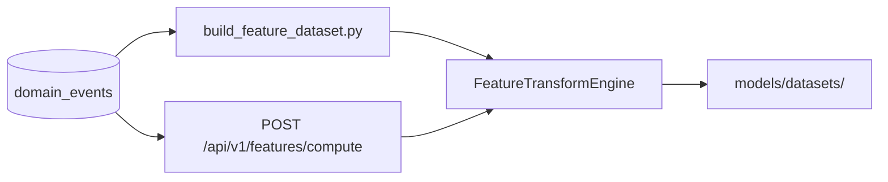

# AEGIS Feature Pipeline (Phase 14)

> Reference for Phases 15–17 and validation agents.

## Overview

The feature pipeline transforms authoritative PostgreSQL `domain_events` rows into versioned `FeatureVectorV1` records. Offline dataset generation and online inference share `aegis_ml.features.compute_features_from_events`.

**Not in scope:** detection rules (Phase 15), anomaly models (Phase 16), graph-risk propagation (Phase 17).

## Data flow



## Schema version

| Artifact | Version constant |
|----------|------------------|
| Feature schema | `FEATURE_SCHEMA_VERSION = 1` |
| Transform | `TRANSFORM_VERSION = 0.0.0-phase14` |
| Workspace | `WORKSPACE_VERSION = 0.0.0-phase14` |

## Window semantics

- **Type:** simulation-time tumbling windows
- **Duration:** 300 sim-seconds (configurable in manifest v1)
- **Key:** `{runId}:{entityId}:{windowStartEpoch}`
- **Entity key:** `payload.assetId`
- **Closure:** when an event opens a later window for the same entity, prior windows close and emit vectors
- **Late events:** rejected after window closure (`FEATURE_LATE_EVENT`)

## Accepted inputs

Registered telemetry types only:

- `telemetry.authentication.failed` / `telemetry.authentication.succeeded`
- `telemetry.api.request`
- `telemetry.database.query`
- `telemetry.network.connection`
- `telemetry.process.activity`
- `telemetry.deployment.event`
- `telemetry.health.check`
- `telemetry.ai.inference`

**Rejected:** `sim.hidden_condition.*`, other `sim.*`, lifecycle, alert, and model events.

## Feature ordering (v1)

27 features in stable `orderIndex` order — see `GET /api/v1/features/schema` or `FEATURE_SCHEMA_MANIFEST_V1`.

Categories: authentication, API, database, network (+ protocol one-hot), process, deployment, health, AI.

## Missing values

| Kind | Behavior |
|------|----------|
| Rates with zero denominator | `-1.0` (`missingSentinel`) |
| Counts with no events | `0.0` |
| Network protocol | one-hot from versioned map v1: `tcp`, `udp`, `__MISSING__` |

## Offline interface

```bash
uv run python scripts/build_feature_dataset.py --run-id <run_id> [--output models/datasets/<run-id>]
```

Produces `features.jsonl` + `manifest.json` with `sha256:` checksum.

## Online interface

| Endpoint | Purpose |
|----------|---------|
| `GET /api/v1/features/schema` | Feature schema manifest |
| `POST /api/v1/features/compute` | Compute vectors from PG events |
| `POST /api/v1/features/parity-check` | Offline/online checksum parity |
| `GET /features/observability` | Diagnostic HTML UI |

## Environment variables

| Variable | Default | Purpose |
|----------|---------|---------|
| `AEGIS_FEATURE_BATCH_SIZE` | `1000` | Reserved for streaming batch reads |

## Constraints for dependent phases

- Do not read hidden scenario manifests or `expected-evidence.yaml` during inference feature computation.
- Preserve `featureSchemaVersion` on model manifests and scores (Phase 01 contracts).
- Scenario-level holdouts are evaluation design; feature rows remain event-derived only.

## Validation commands

```bash
uv run ruff check .
uv run pytest tests/ml/features -q
uv run pytest -q
pnpm check-contracts
```
