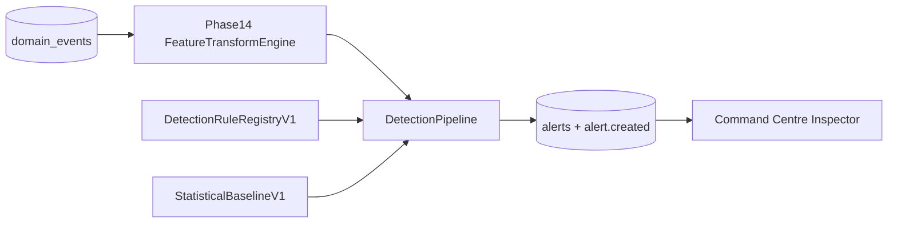

# AEGIS Rules and Statistical Baselines (Phase 15)

> Reference for Phases 16–17 and validation agents.

## Overview

Phase 15 evaluates versioned deterministic rules and calibrated statistical baselines against Phase 14 `FeatureVectorV1` inputs. Results promote to authoritative `AlertV1` records and `alert.created` domain events.

**Not in scope:** Isolation Forest (Phase 16), graph-risk propagation (Phase 17), incident correlation.

## Data flow



## Rule registry (v1.0.0)

| Rule ID | Type | Primary features |
|---------|------|------------------|
| `rule-unusual-login` | deterministic | `auth_failure_rate`, `auth_failed_count` |
| `rule-unseen-source` | deterministic | `auth_event_count`, `net_connection_count` |
| `rule-service-account-misuse` | deterministic | `auth_failure_rate`, `api_request_count` |
| `rule-data-volume` | statistical_baseline | `net_bytes_total`, `db_query_count` |
| `rule-unusual-paths` | deterministic | `proc_suspicious_rate`, `proc_event_count` |
| `rule-deploy-health-correlation` | deterministic | `deploy_failure_rate`, `health_unhealthy_rate` |
| `rule-alert-flood-drift` | deterministic | meta `alert_count` |

Thresholds: `services/incidents/src/aegis_incidents/rules/config/thresholds_v1.yaml`

## Baselines

- **Training seeds:** `1`, `11`, `1006`
- **Holdout seeds:** `1000`, `1007`, `1014`
- **Method:** rolling mean/std with z-score threshold (default 3.0)
- **Artifacts:** `models/baselines/v1/baseline.json` + `manifest.json`

## Deduplication and suppression

- **Dedup key:** `{runId}:{ruleId}:{entityId}:{windowStartEpoch}`
- **Cooldown:** per-rule `cooldownSimSeconds` (default 600 sim-seconds)
- **Suppression groups:** `auth`, `volume`, `paths`, `deploy-health`, `meta`

## APIs

| Endpoint | Purpose |
|----------|---------|
| `GET /api/v1/detection/rules` | Rule registry manifest |
| `GET /api/v1/detection/baselines` | Baseline manifest |
| `POST /api/v1/detection/evaluate` | Run detection for persisted run |
| `GET /api/v1/runs/{runId}/alerts` | List alerts |
| `GET /api/v1/alerts/{alertId}` | Alert detail |
| `GET /detection/observability` | Diagnostic HTML UI |

## Operational commands

```bash
uv run python scripts/calibrate_baselines.py
uv run python scripts/run_detection.py --run-id <run_id>
uv run python scripts/evaluate_rules.py
```

## Phase 15 vs Phase 16

| Phase 15 | Phase 16 (deferred) |
|----------|---------------------|
| Transparent deterministic rules | Isolation Forest learned model |
| Calibrated mean/std baselines | Model manifests and `ModelScoreV1` |
| Structured `RuleExplanationV1` | Anomaly explanation artifacts |

## Validation commands

```bash
uv run ruff check .
uv run pytest tests/ml/rules -q
uv run pytest -q
pnpm check-contracts
pnpm typecheck
```
