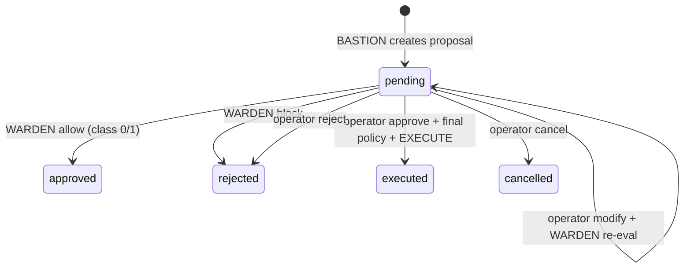

# Policy and Proposals (Phase 22)

Phase 22 introduces **BASTION** response proposal generation and **WARDEN** deterministic policy evaluation. Neither role mutates simulation state or executes containment commands.

## Responsibilities

| Role | Responsibility | Authority |
|------|----------------|-----------|
| BASTION | Evidence-grounded response proposals with 1–3 options | Creates `ActionProposalV1` v2 + `ProposalRevisionV1`; emits `action.proposal.created` |
| WARDEN | Deterministic policy evaluation | `PolicyEngine` in `packages/policy`; emits `action.proposal.policy_evaluated` |
| Human (Phase 24) | Approve/reject/modify class 2/3 proposals | Backend-enforced via `/action-proposals/{id}/approve|reject|modify` — see `docs/approval-workflow.md` |

## Schema overview

- **ActionProposalV1 v2** — identity anchor: `currentRevisionId`, `scenarioCommand`, `status`, `actionClass`
- **ProposalRevisionV1** — append-only rich body: response options, rationale, risk tradeoffs, linked hypotheses
- **PolicyInputV1** — evaluation snapshot: action class, command template, asset criticality, incident state
- **PolicyDecisionV1** — outcome (`allow` / `block` / `approval_required`), reason codes, optional `approvalRequirement`
- **InvestigationDetailV1 v3** — aggregates `proposals`, `proposalRevisions`, `policyDecisions`

## Action-class policy mapping

| Class | Commands | Policy outcome |
|-------|----------|----------------|
| class_0 | `observe` | Allow (informational) |
| class_1 | `increase_monitoring` | Allow (reversible, low impact) |
| class_2 | `isolate`, `restrict_access`, `revoke_credentials` | `approval_required` |
| class_3 | `restart_service`, `rollback_deployment` | `approval_required`; block on high criticality + scenario restriction |

## Lifecycle

## Tool boundaries

**BASTION allowlist:** read investigation artifacts; `create_response_proposal`. No execution tools, no hypothesis mutation.

**WARDEN allowlist:** read-only (`get_incident`, `list_proposals`, `get_risk_scores`). Cannot create proposals.

## Stale revision handling

`TriggerWardenRequestV1` accepts optional `proposalId`. Policy engine compares `policyInput.currentRevisionId` to the proposal anchor; mismatch → `block` with `blocked_stale_revision`. Prepares Phase 24 pre-execution revalidation.

## Phase boundaries

- **Phase 23 (SCRIBE):** evidence-linked after-action reporting via `aegis_reports` + SCRIBE narrative; immutable `ReportVersionV1` artifacts — see `docs/reports.md`
- **Phase 24:** approval UI, approve/reject/modify routes, final WARDEN revalidation, simulator command execution — see `docs/approval-workflow.md` and ADR 0025
- Class 2/3 proposals stay `pending` with `approval_required` until an operator decision; no autonomous execution

## References

- ADR 0023 — BASTION/WARDEN Policy and Proposals
- ADR 0024 — SCRIBE evidence-linked reporting
- ADR 0025 — Approval Workflow
- `docs/AEGIS-v1.0-Agent-Specs/agent-system/22-bastion-and-warden.md`
- `docs/approval-workflow.md`
- `packages/policy/README.md`
