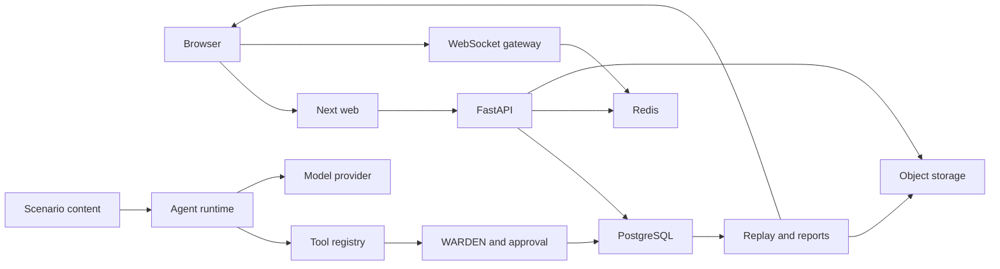

# AEGIS Phase 32 Trust-Boundary Threat Model

## Executive summary

AEGIS combines an internet-facing web/API surface, authoritative operational state, realtime delivery, untrusted scenario/model content, human-approved agent actions, and a local build/scanning supply chain. The highest-risk abuse paths are identity/approval bypass, prompt-driven tool escalation, arbitrary provider egress, credential leakage, stored active content in exported artifacts, and unsafe image/CI changes. The implemented design keeps authority in server-side auth, deterministic WARDEN policy, explicit approval and final revalidation; it adds bounded HTTP middleware, exact provider destinations, production secret validation, prompt-data delimiting, unified redaction, context-safe report export, application-container least privilege, SBOMs, and severity-gated local scans.

## Scope and assumptions

- In scope: `apps/api`, `apps/web/next.config.ts`, `services/agents`, `services/reports`, `packages/model-provider`, `packages/observability`, the reused policy/auth/approval/WS/storage boundaries, `tests/security`, the four application Dockerfiles, Compose runtime hardening, and local-only supply-chain/CI scans.
- Out of scope for this job: offensive testing, real targets, Kubernetes/WAF/Redis-backed rate limiting, registry publishing, deployment automation, host/root compromise, and certification claims.
- Assumption: the web and API may be internet-reachable behind a TLS-terminating production proxy; PostgreSQL, Redis, and object storage are private service-network dependencies.
- Assumption: scenario content is synthetic but attacker/operator-authored content is still untrusted; credentials, sessions, approvals, audit/event history, model requests, and private exports are sensitive.
- Assumption: one deployment trust domain is used. Hostile multi-tenant isolation and direct public exposure of PostgreSQL/Redis/object storage would raise several priorities and require a separate architecture decision.
- Runtime controls are modeled separately from build/CI controls. Every required runtime trust boundary appears in the threat table and maps to a stable control ID in `control-matrix.md`.

Open questions that would change residual risk are whether production uses multiple API processes (the limiter is intentionally per-process), whether any deployment exposes data services outside a private network, and whether future scenario authors are mutually hostile tenants.

## System model

### Primary components

- Next.js serves the command centre and derives connect destinations from configured API/WS origins (`apps/web/next.config.ts`).
- FastAPI is the HTTP/WS entry point and mounts public auth/health plus permission-protected domain routers (`apps/api/src/aegis_api/main.py:create_app`).
- PostgreSQL is authoritative; Redis streams/caches and object storage are delivery/projection/artifact adapters (`docs/architecture.md`, persistence/event-streaming packages).
- The controlled agent runtime sends schema-constrained requests through provider adapters and dispatches model-originated tool calls only through `ToolExecutor` and `authorize_tool_call`.
- WARDEN policy and the approval workflow gate state-changing proposals before internal idempotent simulation commands (`aegis_policy.engine.PolicyEngine`, `aegis_api.approvals.service.ApprovalWorkflowService`).
- Replay/report/export services consume authoritative data and create non-authoritative artifacts. HTML export is an explicit active-content boundary (`aegis_reports.export`).
- CI checks out source and lockfiles, builds the four application images locally, emits CycloneDX SBOMs, and scans source, Dockerfiles, Compose, and image contents. The workflow has read-only repository permission and no registry or deployment credentials (SEC-017–SEC-020).

### Data flows and trust boundaries

- Internet browser → Next.js web: HTML, JavaScript, styles, graph/canvas/worker assets over HTTP(S). Headers deny framing/sniffing and restrict scripts, workers, connections, permissions, and referrers (SEC-005).
- Next.js web → FastAPI: session cookies, CSRF tokens, correlation headers, JSON commands/queries over HTTP(S). OIDC/session auth, deny-by-default permission dependencies, CSRF/CORS, security headers, body bounds, and per-session/IP rate bounds apply (SEC-001–SEC-004, SEC-015).
- API/workers → PostgreSQL/Redis/object storage: credentials, domain records/events, stream messages, model/report/snapshot artifacts over database/Redis/S3 protocols. PostgreSQL remains authoritative; adapters and startup secret validation constrain access (SEC-007, SEC-009, SEC-010).
- Browser → WebSocket gateway: session-derived WS ticket and versioned realtime messages over WS(S). Ticket auth, permission checks, connection/queue/message bounds, and sequence recovery apply (SEC-006).
- Agent runtime → tools: model-originated structured tool names/arguments cross an in-process privilege boundary. Registry visibility, role/definition allowlists, execution-class denial, schema validation, handler registration, and audit persistence apply (SEC-012).
- Agent runtime → model provider: prompts/structured schemas and credentials leave the deployment over HTTP(S). Vendor clients stay behind adapters, exact base URLs are allowlisted at construction, and provider artifacts are redacted/bounded (SEC-010, SEC-011).
- Scenario content → runtime/prompts: manifests, labels, telemetry, incident titles, and evidence cross from authored data to deterministic runtime/model context. Scenario SDK validation/no arbitrary Python plus bounded user-role JSON delimiting keep content data-only; downstream authority never comes from prompts (SEC-013, SEC-012, SEC-014).
- Replay/report/export artifacts → storage/browser: schema-versioned snapshots, generated narrative, citations, Markdown/JSON/HTML, filenames, and checksums cross a durable artifact boundary. HTML encoding, rooted template lookup, grounding, schema/checksum validation, authz, and private storage adapters apply (SEC-008, SEC-001, SEC-007).
- CI checkout/lockfiles → local application images → scanner artifacts: source, dependency metadata, Docker build output, SBOMs, SARIF, and license metadata cross a build trust boundary. Builds are local-only; scanner failures gate defined severities, and reports are retained as workflow artifacts (SEC-017–SEC-020).

#### Diagram

## Assets and security objectives

| Asset                                                       | Why it matters                                                               | Security objective (C/I/A) |
| ----------------------------------------------------------- | ---------------------------------------------------------------------------- | -------------------------- |
| Session/OIDC/CSRF credentials                               | Theft enables impersonation and privileged API/WS access                     | C, I                       |
| Database/object/provider credentials                        | Leakage grants dependency access or paid provider use                        | C, I, A                    |
| Authoritative runs, events, incidents, proposals, approvals | Tampering breaks deterministic replay, auditability, and human control       | I, A                       |
| Agent definitions/tool registry/policy                      | Changes can expose execution or bypass deterministic authorization           | I                          |
| Scenario manifests and prompt context                       | Untrusted strings can attempt instruction injection or resource exhaustion   | I, A                       |
| Model requests/responses/artifacts                          | May contain sensitive context; nondeterministic output must remain auditable | C, I                       |
| Redis streams/WS sequence state                             | Abuse can disrupt realtime delivery but cannot replace PostgreSQL truth      | I, A                       |
| Reports/replay/export objects                               | Stored active content or traversal can affect operators and filesystem data  | C, I                       |
| Security audit/observability records                        | Detection depends on integrity without leaking secrets/high-cardinality data | C, I, A                    |

## Attacker model

### Capabilities

- An unauthenticated remote client can send malformed, oversized, bursty HTTP/WS traffic and manipulate headers, cookies, origins, and request bodies.
- An authenticated low-privilege user can submit allowed domain inputs, replay stale approval requests, and attempt ID/role/CSRF confusion.
- A scenario author or compromised scenario package can place adversarial strings in manifests, labels, telemetry, incident context, and eventual reports.
- A model provider or deterministic malicious provider response can emit arbitrary prose and schema-valid unauthorized tool requests.
- An attacker who controls environment/configuration input can attempt provider URL tricks or leave development credentials enabled.

### Non-capabilities

- The model does not receive unrestricted shell, filesystem, network, or execution tools; execution-class tools are not model-visible.
- Scenario content does not execute arbitrary Python by default and cannot directly write authoritative state.
- Redis/browser/rendered graphs/reports are not authoritative and cannot legitimately override PostgreSQL state.
- This model does not assume host/root compromise, malicious cloud control plane operators, compromised dependency builds, or real-target offensive access; those require separate models.

## Entry points and attack surfaces

| Surface                    | How reached                               | Trust boundary                | Notes                                                                                    | Evidence (repo path / symbol)                                                      |
| -------------------------- | ----------------------------------------- | ----------------------------- | ---------------------------------------------------------------------------------------- | ---------------------------------------------------------------------------------- |
| Next.js routes/assets      | Browser HTTP(S)                           | Browser → web                 | CSP must support Next hydration, Sigma/Three assets, and graph workers                   | `apps/web/next.config.ts`                                                          |
| Auth/session/OIDC routes   | `/api/v1/auth/**`                         | Web → API                     | Public entry with server sessions, secure cookies, CSRF on mutations                     | `apps/api/src/aegis_api/auth/**`                                                   |
| Domain REST routers        | `/api/v1/**`                              | Web → API                     | Permission dependencies mounted centrally; body/rate middleware runs first               | `apps/api/src/aegis_api/main.py:create_app`                                        |
| Health/readiness           | `/health`, `/live`, `/ready`              | Monitoring → API              | Rate-limit exempt so overload detection remains available; readiness probes dependencies | `aegis_api.security.middleware.RATE_LIMIT_EXEMPT_PATHS`; `aegis_api.observability` |
| WebSocket gateway          | configured WS path and ticket route       | Browser → WS                  | Session/ticket permission, queue/connection/message bounds                               | `apps/api/src/aegis_api/websocket/auth.py`; `connection.py`                        |
| Persistence adapters       | DB/Redis/S3 clients                       | API/workers → data services   | Credentials and artifacts cross service boundary                                         | `aegis_api/db/session.py`; `aegis_persistence/object_storage.py`                   |
| Provider adapters          | OpenAI-compatible client construction     | Agent → provider              | Exact configured base URL; no per-request destination                                    | `aegis_model_provider/egress.py`; `adapters/openai_*.py`                           |
| Tool dispatcher            | structured `toolRequests`                 | Model → tools                 | Three authorization/validation layers; execution class denied                            | `aegis_agents/tools/registry.py`; `permissions.py`; `executor.py`                  |
| Scenario prompt encoder    | incident/scenario fields                  | Scenario → model              | User-role bounded JSON with escaped delimiter characters                                 | `aegis_agents/security/scenario_content.py`                                        |
| Approval endpoints         | approve/reject/modify/cancel              | Human/session → simulation    | Session actor, stale check, WARDEN recheck, idempotent internal command                  | `aegis_api/approvals/service.py`                                                   |
| Report exporters/templates | report export endpoints and template name | Artifact → browser/filesystem | Model/report fields are stored-XSS inputs; template name is traversal input              | `aegis_reports/export.py`                                                          |
| Logs/traces/artifacts      | application instrumentation               | Runtime → operators/storage   | Shared recursive redaction; prompts/tokens excluded                                      | `aegis_model_provider/redaction.py`; `aegis_observability/logging.py`              |

## Top abuse paths

1. Attacker steals or forges a session/CSRF context → calls a protected approval route → attempts a Class 2/3 simulation change. Server session resolution, permission checks, current revision, WARDEN revalidation, explicit approval record, and idempotent command mapping prevent direct execution (SEC-001, SEC-014).
2. Remote client omits or lies about `Content-Length` → streams an oversized JSON body → attempts memory/CPU exhaustion. The ASGI boundary counts actual bytes and returns structured 413 before route logic (SEC-003).
3. Remote client rotates paths or arbitrary session-cookie values → tries to exhaust API capacity while hiding among probes. Dual IP/session token buckets and a deterministic LRU memory bound return structured 429 while `/health`, `/live`, and `/ready` remain observable (SEC-004).
4. Scenario title says to ignore policy and close the data delimiter → malicious provider emits `execute_simulation_command` → runtime attempts dispatch. Delimiter characters are escaped and, independently, execution-class/role/definition authorization rejects and audits the call (SEC-013, SEC-012).
5. Operator/config attacker sets provider base URL to metadata IP or `api.openai.com.evil` → provider adapter would exfiltrate prompts/credentials. Construction fails unless the normalized entire base URL exactly matches the allowlist and contains no userinfo/query/fragment (SEC-011).
6. Model-generated report embeds `<script>` or event-handler markup → operator opens HTML export → stored XSS steals session or forges UI actions. Every interpolated HTML field is context-escaped and web/API framing/CSP reduce residual impact (SEC-008, SEC-005).
7. Caller supplies `../../.env.example` as a report template → service reads outside template root → configuration disclosure. Resolved path must retain the resolved report-template prefix (SEC-008).
8. Production is deployed with `.env.example` database/object credentials or blank OIDC secret → attacker guesses credentials or auth starts insecurely. Composite startup validation fails before dependency startup and errors contain names only (SEC-009, SEC-010).
9. A vulnerable or compromised application image runs with a writable root, excess capabilities, or privilege escalation enabled → a process exploit modifies its image filesystem, reaches mounted data, or pivots toward the host. Non-root users, read-only roots, bounded `/tmp`, dropped capabilities, and `no-new-privileges` reduce the application-container blast radius; infrastructure services retain a documented service-specific exception (SEC-016).
10. A malicious dependency, base-image layer, or build input enters a local application image → code or a known vulnerable component executes with application credentials. Lockfiles and package-manager controls remain in place; per-image CycloneDX SBOMs and fixable high/critical Trivy gates make the component set reviewable before release (SEC-017, SEC-019).
11. A changed workflow, mutable scanner image, or suppressed scan result hides a supply-chain finding or exfiltrates source → an unsafe artifact is accepted as green. GitHub actions are pinned to commit SHAs, the workflow has `contents: read`, scanners run without credentials, and changes to scanner policy require review; scanner container tags remain a residual supply-chain consideration (SEC-018, SEC-019).
12. A Compose or Dockerfile change exposes a service, enables privilege, or removes a required writable-path restriction → local or production-like deployments drift from the intended container boundary. Trivy config, Hadolint, Compose config validation, and the control matrix provide detection and review evidence (SEC-016, SEC-018).
13. A dependency has unknown or incompatible license metadata → the product ships a component without the required legal/release decision. CycloneDX metadata is converted into a non-blocking license report and every unknown or newly restricted result must be tracked with the owning pull request before release (SEC-020).

## Threat model table

| Threat ID | Threat source                                    | Prerequisites                                                               | Threat action                                                                                         | Impact                                                           | Impacted assets                                         | Existing controls (evidence)                                                                                                                                         | Gaps                                                                                                | Recommended mitigations                                                                                            | Detection ideas                                                                                 | Likelihood                                                    | Impact severity                          | Priority |
| --------- | ------------------------------------------------ | --------------------------------------------------------------------------- | ----------------------------------------------------------------------------------------------------- | ---------------------------------------------------------------- | ------------------------------------------------------- | -------------------------------------------------------------------------------------------------------------------------------------------------------------------- | --------------------------------------------------------------------------------------------------- | ------------------------------------------------------------------------------------------------------------------ | ----------------------------------------------------------------------------------------------- | ------------------------------------------------------------- | ---------------------------------------- | -------- |
| TM-001    | Remote/low-privilege browser user                | Internet/API access; stolen session or crafted cross-origin request         | Bypass auth, CSRF, framing, or role checks to read/mutate state or approve actions                    | Unauthorized disclosure/state change                             | Sessions, authoritative state, approvals                | SEC-001/002/005/014; auth startup, permission matrix, CSP/frame denial, final policy check; `tests/security/auth/**`, `tests/security/test_agent_policy_bypasses.py` | Web CSP needs config-only `'unsafe-inline'`; session compromise remains powerful                    | Move web CSP to per-request nonces when practical; alert on approval-role/session anomalies                        | Security audit login/approval events; CSRF/401/403 rates; CSP reports when endpoint exists      | Medium: common attack class but layered server controls exist | High: approval/state integrity           | High     |
| TM-002    | Remote client                                    | HTTP reachability                                                           | Oversized/chunked bodies or burst requests exhaust workers                                            | API degradation/DoS                                              | API/WS availability, operator access                    | SEC-003/004/006; actual-byte body count, token bucket, WS bounds; `test_api_hardening.py`                                                                            | Limiter is per-process and memory state resets on restart                                           | Size process-local limits for replica count; measure before any shared limiter ADR                                 | Structured 413/429 counts, API latency/errors, active WS/queue depth                            | High: cheap and automatable                                   | Medium: bounded to service availability  | High     |
| TM-003    | Network/config attacker                          | Ability to reach or influence dependency config                             | Steal credentials, redirect storage/DB traffic, or corrupt projections/artifacts                      | Data disclosure/corruption; outage                               | DB/object credentials, events, artifacts                | SEC-007/009/010; adapters, production required values, readiness, redaction                                                                                          | Transport/private-network enforcement is deployment-owned; signed download review remains important | Keep dependencies private with TLS credentials; least-privilege DB/bucket policies; rotate per guidance            | Readiness transitions, auth failures, object audit logs, unexpected dependency addresses        | Medium under private-network assumption                       | High: authoritative state/credentials    | High     |
| TM-004    | Remote authenticated/unauthenticated WS client   | WS endpoint reachability                                                    | Reuse/forge tickets, exceed message bounds, create connection/queue pressure, or inject sequence data | Realtime disclosure/desync/DoS                                   | WS sessions, Redis delivery, browser projection         | SEC-006; shared session/ticket permission, max connection/queue/message settings, gap recovery; integration gateway tests                                            | Per-process connection caps; TLS termination external                                               | Short ticket TTL, origin allowlist at deployment, monitor reconnect/message rejection rates                        | WS auth failures, connection count, rejected oversized messages, delivery lag/gaps              | Medium                                                        | Medium: PostgreSQL remains authoritative | Medium   |
| TM-005    | Malicious scenario/model content                 | Scenario content reaches prompt or provider returns structured tool request | Inject privileged instructions and request execution/role-incompatible tools                          | Policy bypass or simulated state mutation                        | Tool registry, proposals, simulation state              | SEC-012/013/014; data delimiter, structured output, authorization layers, WARDEN/approval; unauthorized fixture tests                                                | Delimiters cannot guarantee model obedience; downstream controls must never be removed              | Keep execution tools internal; add every new tool to bypass matrix before release                                  | Rejected `ToolInvocationV1`, unauthorized tool metrics, abnormal proposal volume                | High: prompts/models are attacker-controlled by design        | High: if downstream control regresses    | High     |
| TM-006    | Config attacker or compromised scenario/operator | Can modify provider base URL/allowlist or select a network provider         | SSRF to metadata/internal endpoints, credential-in-URL leak, or arbitrary prompt exfiltration         | Secret/context disclosure; provider misuse                       | Provider credentials, prompts, internal network         | SEC-011/009/010; exact construction-time allowlist, URL form rejection, redaction; `test_provider_egress.py`                                                         | Allowlist itself is deployment configuration; DNS rebinding is not pinned at socket level           | Restrict who can change config; prefer fixed HTTPS provider endpoints and network egress rules in deployment phase | Startup/provider validation failures, unexpected provider IDs, egress network telemetry         | Medium                                                        | High                                     | High     |
| TM-007    | Malicious scenario author/content                | Scenario package accepted/published                                         | Inject code/privileged prompt instructions or pathological content into deterministic runtime         | Determinism/policy loss, resource exhaustion                     | Scenario integrity, agent context, runtime availability | SEC-013/012/014; declarative SDK/no arbitrary Python, bounded data message, server tool/policy gates                                                                 | Full hostile multi-tenant scenario isolation is not assumed                                         | Preserve allowlisted built-ins; bound all future scenario prompt fields; sign/pin published scenario versions      | Publication audit, validation failures, scenario hash/version changes, rejected tools           | Medium in current single trust domain                         | High if arbitrary execution introduced   | High     |
| TM-008    | Model/scenario/report content or export caller   | Ability to influence report fields/template name or retrieve private export | Stored XSS, path traversal, malicious artifact replay, or unauthorized export                         | Session/UI compromise; file/config disclosure; misleading replay | Reports, filesystem, sessions, replay integrity         | SEC-008/001/005/007; HTML escaping, rooted templates, report authz, schema/checksum/storage adapters; export tests                                                   | Markdown consumers apply their own renderer policy; private object signing depends on storage path  | Serve HTML downloads with restrictive CSP/content disposition where appropriate; keep signed URLs short-lived      | Export security audit, traversal/validation errors, checksum mismatch, unusual download volume  | Medium                                                        | High                                     | High     |
| TM-009    | Runtime error/provider response/operator         | Sensitive value enters log/span/artifact                                    | Leak tokens, cookies, keys, prompts, or passwords to telemetry/storage                                | Credential theft and lateral access                              | All secrets, sessions, provider data                    | SEC-010/009; one recursive redaction implementation reused by observability, provider request sanitization, no secret values in startup errors                       | Novel secret formats may evade pattern matching; key-based redaction is stronger but contextual     | Add patterns only to canonical redaction; minimize logged attributes; rotate on suspected leak                     | Secret-scan telemetry sink out of band; tests for new credential formats; exporter access audit | Medium                                                        | High                                     | High     |
| TM-010    | Compromised process or vulnerable runtime image     | Application image exploit; container runtime reachability                   | Write outside the application root, use excess capabilities, escalate privileges, or pivot through mounts | Container/host compromise; secret or service access                  | App credentials, mounted data, host/runtime                 | SEC-016; non-root users, read-only app roots, bounded `/tmp`, `cap_drop: ALL`, no-new-privileges; Compose config review                         | Host kernel, Docker daemon, and infra images remain deployment-owned; app hardening is not a host boundary | Use rootless/isolated runtime where practical; harden each stateful image with service-specific tests before production | Container runtime audit, denied-write/capability events, unexpected process trees, image digest drift       | Medium                                                        | Critical                                 | Critical |
| TM-011    | Malicious dependency/base-image/build input          | Attacker controls or compromises an upstream component or build input      | Inject code, a known vulnerable library, or a tampered image layer into a local application image          | Code execution, data disclosure, integrity loss                        | Application image, provider/data credentials, build output | SEC-017/019; frozen lockfiles, pinned versioned bases, local-only builds, CycloneDX SBOMs, fixable high/critical Trivy gate                        | No registry signature/provenance attestation in this phase; version tags are not immutable digests             | Add digest/signature verification and provenance attestation before external release; review SBOM diffs        | SBOM component diff, dependency audit, base-image refresh alerts, unexpected build-layer changes              | Medium                                                        | High                                     | High     |
| TM-012    | CI/workflow or scanner supply-chain attacker          | Ability to alter workflow/scanner reference or compromise a build dependency | Hide findings, alter artifacts, or use the CI runner to exfiltrate repository contents                       | Unsafe release decision; source disclosure                         | Source, scan results, release controls                  | SEC-018/019; actions pinned by commit SHA, `contents: read`, no secrets/push/deploy steps, artifact reports, reviewed policy changes       | Version-tagged scanner containers and runner trust remain residual risks                                   | Pin scanner images by digest; protect workflow changes and review artifact contents                         | Workflow diff review, action audit log, artifact integrity checks, unexpected network/process activity     | Low/medium                                                   | High                                     | High     |
| TM-013    | Developer/configuration change                           | Compose or Dockerfile change reaches a build or local deployment             | Expose a port, enable privilege, remove a tmpfs/volume bound, or introduce an unsafe Dockerfile instruction | Service exposure, privilege escalation, availability loss            | Container runtime, data services, local secrets          | SEC-016/018; Compose `config`, Trivy config, Hadolint, read-only/capability policy, no-new-privileges                       | Upstream infrastructure images keep defaults for local compatibility; deployment overlays are not scanned here | Scan deployment overlays in their owning pipeline; add service-specific hardening only after health validation | IaC SARIF, Compose diff, exposed-port inventory, runtime security context inspection                      | Medium                                                        | High                                     | High     |
| TM-014    | Third-party component owner/release process             | License metadata is missing, unknown, or incompatible with distribution      | Ship a dependency without legal/release review or misrepresent component obligations                         | Release/legal exposure; forced removal or delay                     | Dependency inventory, product distribution, release decision | SEC-020/019; CycloneDX-derived license report, PR/issue tracking, non-silent owner/release triage            | Automated license allowlist and legal determination are not implemented in this phase                  | Establish approved SPDX policy and legal review path; fail future restricted-license classes once policy exists | License-report diffs, missing SPDX identifiers, dependency owner review                                | Medium                                                        | Medium                                   | Medium |

## Criticality calibration

- Critical: a remotely exploitable path that directly executes an internal simulation command without policy/approval; cross-tenant or unauthenticated access to authoritative PostgreSQL; exfiltration of production secret-manager contents. None is accepted as residual behavior.
- High: session/approval bypass; arbitrary provider SSRF with credentials/prompts; stored XSS in privileged operator exports; scenario/model content reaching unauthorized tools; corruption of append-only audit/event history.
- Critical/high supply-chain cases include container escape or host pivot, malicious code in a released dependency/image, and a CI result that is intentionally falsified. A blocking scan finding is not residual risk merely because it is inconvenient to upgrade.
- Medium: bounded per-process API/WS denial of service; realtime projection poisoning recoverable from PostgreSQL; partial non-secret diagnostic/artifact disclosure requiring authentication.
- Low: noisy malformed requests rejected before domain code; CSP/frame attempts with no script execution; low-sensitivity version/health disclosure needed for operations.

## Focus paths for security review

| Path                                                            | Why it matters                                                                      | Related Threat IDs     |
| --------------------------------------------------------------- | ----------------------------------------------------------------------------------- | ---------------------- |
| `apps/api/src/aegis_api/main.py`                                | Central middleware order and router permission mounting define the HTTP choke point | TM-001, TM-002         |
| `apps/api/src/aegis_api/security/middleware.py`                 | Parses adversarial bodies/cookies/headers and maintains rate state                  | TM-001, TM-002         |
| `apps/api/src/aegis_api/security/startup.py`                    | Decides whether unsafe production configuration can start                           | TM-003, TM-009         |
| `apps/api/src/aegis_api/auth/**`                                | Session, OIDC, CSRF, secure cookie, and actor derivation boundary                   | TM-001, TM-004         |
| `apps/api/src/aegis_api/websocket/**`                           | Ticket auth, message bounds, connection lifecycle, and sequence recovery            | TM-004                 |
| `apps/api/src/aegis_api/approvals/service.py`                   | Last authority boundary before internal simulation execution                        | TM-001, TM-005, TM-007 |
| `packages/policy/src/aegis_policy/engine.py`                    | Deterministic WARDEN allow/block/approval semantics                                 | TM-005, TM-007         |
| `services/agents/src/aegis_agents/tools/**`                     | Model-visible registry, role allowlists, validation, handler dispatch, and audit    | TM-005                 |
| `services/agents/src/aegis_agents/security/scenario_content.py` | Converts attacker-authored scenario strings into model context                      | TM-005, TM-007         |
| `services/agents/src/aegis_agents/runtime/executor.py`          | Joins model output, grounding, tool dispatch, and post-processing                   | TM-005, TM-007         |
| `packages/model-provider/src/aegis_model_provider/egress.py`    | SSRF/exfiltration prevention for provider destinations                              | TM-006                 |
| `packages/model-provider/src/aegis_model_provider/redaction.py` | Canonical secret-key/value sanitization used by provider and observability          | TM-009                 |
| `packages/persistence/src/aegis_persistence/object_storage.py`  | Private artifact credentials/keys and local filesystem path normalization           | TM-003, TM-008         |
| `services/reports/src/aegis_reports/export.py`                  | Stored active content and template filesystem boundary                              | TM-008                 |
| `apps/web/next.config.ts`                                       | Browser CSP/connect/worker/frame policy and explicit unsafe-inline tradeoff         | TM-001, TM-008         |
| `apps/api/Dockerfile`; `apps/web/Dockerfile`                     | Application image users, filesystem ownership, and temporary-directory defaults     | TM-010, TM-011, TM-013  |
| `services/workers/Dockerfile`; `services/simulation/Dockerfile`  | Worker/simulator image users, dependency layers, and temporary-directory defaults    | TM-010, TM-011, TM-013  |
| `docker-compose.yml`                                             | Local runtime security context, writable paths, ports, and service exceptions       | TM-010, TM-013          |
| `.github/workflows/security.yml`                                 | Build/scanner orchestration, action pins, local-only images, and artifact gates      | TM-011, TM-012, TM-013, TM-014 |
| `infra/security/checkov/compose_app_hardening.py`                | Compose-specific least-privilege policy executed by Checkov without secret duplication | TM-010, TM-013          |
| `docs/security/scan-triage-policy.md`                            | Severity gates, evidence tracking, license review, and time-bounded exceptions      | TM-011, TM-012, TM-014  |
